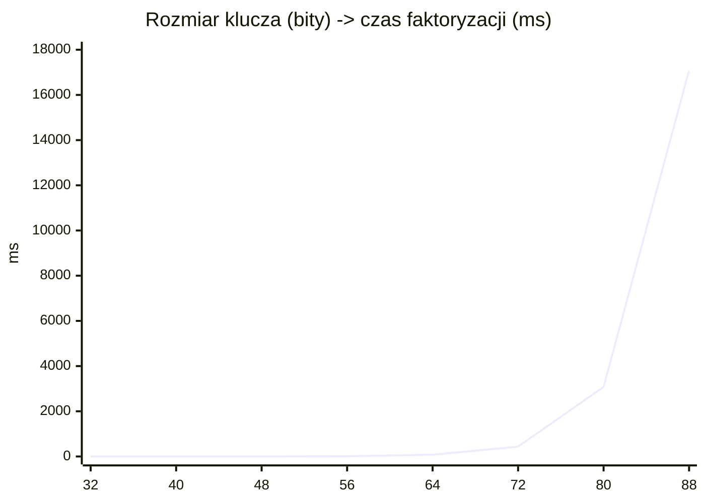

# Lab3 - RSA i faktoryzacja

## 1. Zakres i zalozenia

Zrealizowano oba wymagane elementy laboratorium:

1. Implementacja RSA:
   - wczytanie wiadomosci z pliku,
   - podzial na bloki 10-znakowe,
   - odwracalne mapowanie blok -> liczba,
   - generacja klucza RSA 768-bit,
   - szyfrowanie i odszyfrowanie blok po bloku,
   - walidacja zgodnosci blok po bloku i calosci.
2. Test faktoryzacji RSA:
   - benchmark dla kluczy 32, 40, 48, 56, 64, 72, 80, 88 bit,
   - dopasowanie 3 modeli (liniowy, potegowy, wykladniczy),
   - wybor modelu o najwyzszym R^2,
   - ekstrapolacja dla 96, 128, 256 bit.

Uzyty alfabet: pelny ASCII (0-127).

## 2. Opis implementacji RSA

- Kod: `Lab3/rsa.js`, uruchomienie demo: `Lab3/main.js`.
- Bloki: 10 znakow (`splitIntoBlocks`).
- Kodowanie odwracalne (`encodeBlockToNumber`):
  - pierwszy bajt przechowuje rzeczywista dlugosc bloku,
  - kolejne bajty to znaki ASCII,
  - calosc interpretowana jako liczba BigInt.
- Dekodowanie (`decodeNumberToBlock`) odzyskuje oryginalny blok 1:1.
- Generacja klucza:
  - liczby pierwsze przez Miller-Rabin,
  - domyslnie `e = 65537`,
  - dlugosc `n >= 768` bit.
- Szyfrowanie i odszyfrowanie:
  - `c = m^e mod n`,
  - `m = c^d mod n`,
  - walidacja warunku `0 <= m < n`.

Wynik uruchomienia `node Lab3/main.js`:
- dlugosc klucza `n`: 768 bit,
- liczba blokow: 13,
- zgodnosc blok po bloku: `true`,
- zgodnosc calosci: `true`.

## 3. Odpowiedzi do czesci opisowej (RSA)

### 3.1 Dlaczego wybrano e = 65537?

Wybrano `e = 65537`, bo to standardowy kompromis miedzy bezpieczenstwem i wydajnoscia:
- jest nieparzyste i pierwsze,
- ma mala liczbe ustawionych bitow, wiec szyfrowanie jest szybkie,
- unika znanych problemow bardzo malych wykladnikow (np. `e = 3`) przy blednym uzyciu bez paddingu,
- jest powszechnie stosowane w praktyce (OpenSSL, biblioteki kryptograficzne).

### 3.2 Przyklad dla m >= n i wyjasnienie warunku m < n

Test z `Lab3/main.js` (demonstracja):
- `m = n + 42`,
- `m mod n = 42`,
- po szyfrowaniu i odszyfrowaniu otrzymano `42`, a nie oryginalne `m`.

Wniosek: RSA dziala w arytmetyce modulo `n`, wiec dla `m >= n` informacja jest redukowana do reszty `m mod n`.
Dlatego wymagany jest warunek `m < n` dla kazdego szyfrowanego bloku.

### 3.3 Dlaczego identyczne bloki daja identyczny szyfrogram?

W "czystym" RSA (bez paddingu) szyfrowanie jest deterministyczne:
- ta sama para `(m, klucz_publiczny)` zawsze daje to samo `c`.

Przyklad testowy:
- dwa razy zaszyfrowano ten sam blok,
- wynik: `sameCipher = true`.

To ujawnia wzorce w danych (np. powtarzajace sie bloki), co jest niepozadane.

### 3.4 Co to jest padding OAEP i jak rozwiazuje problem?

OAEP (Optimal Asymmetric Encryption Padding) dodaje losowosc przed operacja RSA.
W efekcie:
- ten sam plaintext szyfrowany wielokrotnie daje rozne ciphertexty,
- ukrywa wzorce i wzmacnia odpornosc semantyczna,
- utrudnia ataki bazujace na strukturze danych.

W tym laboratorium implementowano celowo "surowe" RSA do celow dydaktycznych,
ale praktycznie nalezy stosowac RSA z paddingiem (np. OAEP).

## 4. Faktoryzacja RSA - wyniki benchmarku

Metoda faktoryzacji: Pollard Rho.

| Rozmiar klucza [bity] | Metoda      | Czas [ms] | Iteracje | Czy znaleziono p i q? |
| --- | --- | ---: | ---: | --- |
| 32 | Pollard Rho | 0.722 | 143 | TAK |
| 40 | Pollard Rho | 1.786 | 886 | TAK |
| 48 | Pollard Rho | 2.020 | 1111 | TAK |
| 56 | Pollard Rho | 10.260 | 5560 | TAK |
| 64 | Pollard Rho | 75.931 | 33677 | TAK |
| 72 | Pollard Rho | 435.697 | 159357 | TAK |
| 80 | Pollard Rho | 3077.537 | 915552 | TAK |
| 88 | Pollard Rho | 17082.995 | 4555262 | TAK |

Uwaga: czasy moga sie roznic miedzy uruchomieniami (losowe generowanie semiprime i losowe parametry Pollard Rho).

## 5. Wykres: rozmiar klucza -> czas faktoryzacji

## 6. Dopasowanie krzywych i wybor najlepszego modelu

Dopasowano 3 modele:

1. Wykladniczy:
   - `t(bits) = 6.718210e-4 * exp(0.187322 * bits)`
   - `R^2 = 0.776238`
2. Liniowy:
   - `t(bits) = 202.859176 * bits + -9585.682036`
   - `R^2 = 0.446029`
3. Potegowy:
   - `t(bits) = 9.257424e-17 * bits^10.103812`
   - `R^2 = 0.311439`

Najlepszy model: **wykladniczy** (najwyzszy `R^2`).

Uzasadnienie wyboru:
- empirycznie roznica czasu rosnie bardzo szybko wraz z liczba bitow,
- model liniowy zaniza wzrost dla wiekszych kluczy,
- model wykladniczy najlepiej uchwycil trend danych w badanym zakresie.

## 7. Ekstrapolacja

Ekstrapolacja na podstawie najlepszego modelu (wykladniczego):

- 96 bit: `43365.565 ms` (~43.37 s),
- 128 bit: `17395709.782 ms` (~4.83 h),
- 256 bit: `450433557815476992.000 ms` (~6.35e5 lat).

## 8. Czy mozna ufac prognozom dla 1024/2048 bit?

Nie, takich prognoz nie nalezy traktowac jako wiarygodnych ilosciowo.

Powody:
- dane uczace sa z bardzo malego zakresu (32-88 bit),
- dla duzych rozmiarow dominujace efekty obliczeniowe i implementacyjne sa inne,
- praktyczne ataki na duze RSA korzystaja z bardziej zlozonych metod niz prosty Pollard Rho,
- ekstrapolacja daleko poza zakres pomiaru silnie zwieksza blad modelu.

Wniosek: ekstrapolacja dla 1024/2048 bit ma wartosc tylko pogladowa (jakosciowa), nie prognostyczna.

## 9. Pliki oddawane

- Implementacja RSA: `Lab3/rsa.js`
- Faktoryzacja i modelowanie: `Lab3/factorization.js`
- Uruchomienie calosci: `Lab3/main.js`
- Dane testowe: `Lab3/example.txt`
- Testy automatyczne: `Lab3/lab3.test.js`
- Sprawozdanie: `Lab3/sprawozdanie_lab3.md`
